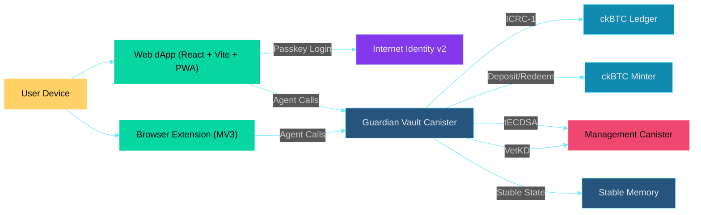
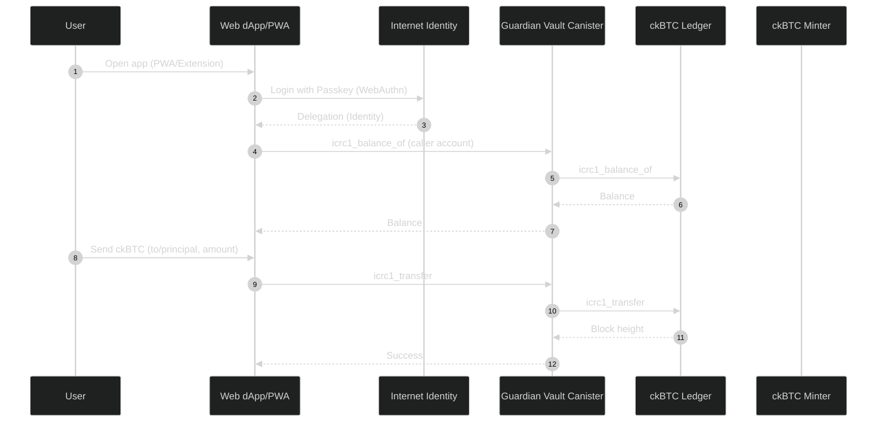
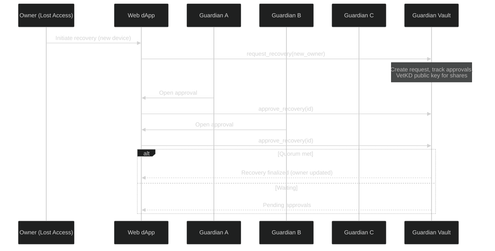

# `guardian-vault`

Guardian Vault is a production-grade, decentralized Bitcoin wallet on ICP using ckBTC, Internet Identity v2 (passkeys), guardian quorum recovery (VetKD), and threshold ECDSA for signing.

## System Architecture



## User Workflow



## Recovery Flow (Guardians + VetKD)



## Deployment & Configuration
- ECDSA key: set correct subnet key name (e.g., `dfx_test_key` locally, `secp256k1` on mainnet).
- ckBTC canisters: configure ckBTC Ledger and Minter principals during canister `init` or via `set_config`.
- Internet Identity: use `https://identity.ic0.app` on `ic` and local canister on `local`.

## Local Development

```bash
# Start local replica
dfx start --background

# Deploy backend (set real canister IDs for ckBTC components)
dfx deploy

# Frontend (workspace)
npm start -w src/guardian-vault-frontend
```

For conceptual background, see:
- Internet Computer docs (DFX, canisters, management APIs)
- ICRC‑1 standard and ckBTC Ledger/Minter
- VetKD, Threshold ECDSA, and Internet Identity
